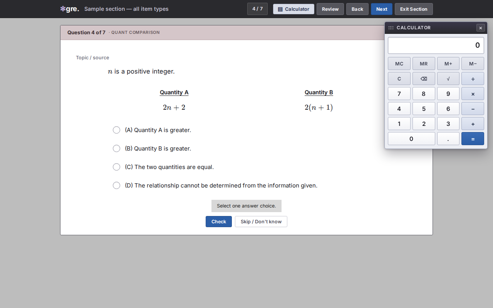
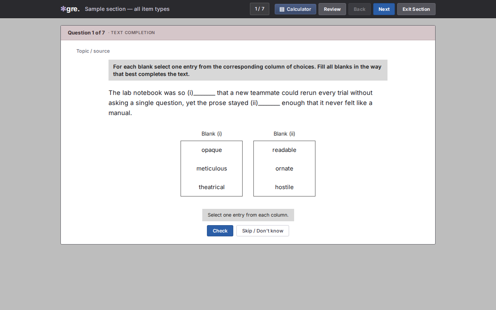
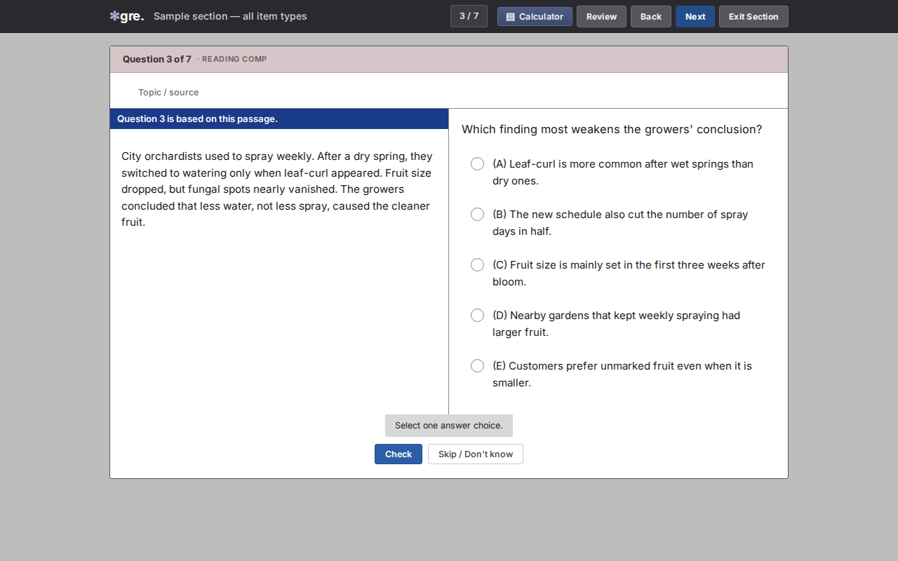
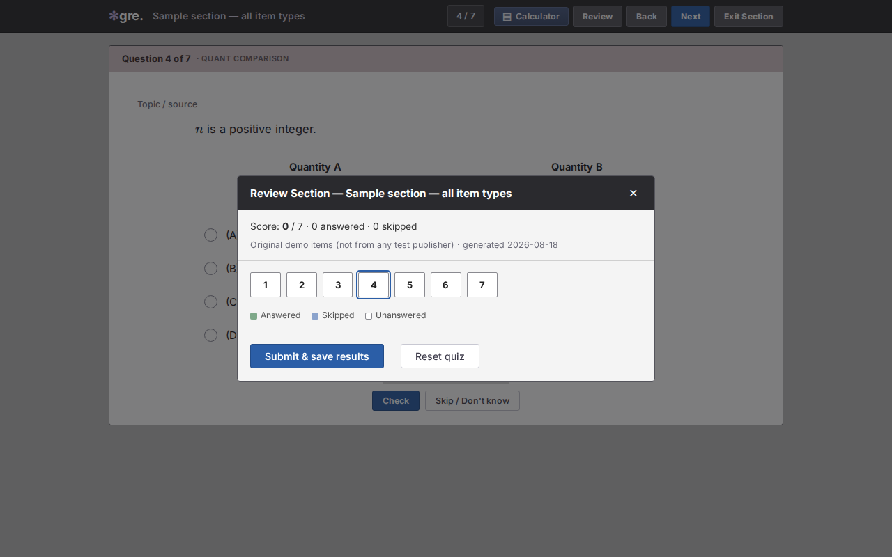
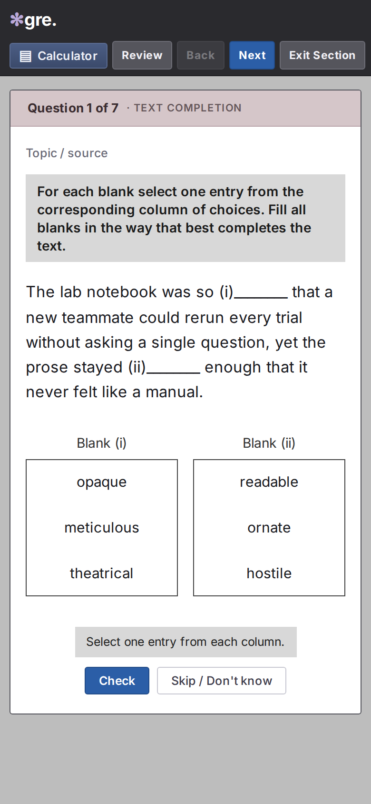

# gre-ui

The computer GRE has a look. Your practice HTML shouldn’t look like a blog.

**gre-ui** turns a JSON file into a single-page section: one item on screen, Back / Next / Review, a Quant calculator you can drag, Text Completion columns, Sentence Equivalence boxes, Reading Comp split pane. You bring the questions. This is only the chrome.

<p align="center">
  
</p>

<p align="center">
  <em>Unofficial. Not ETS, not POWERPREP, not a question bank, not a scored test.</em>
</p>

## Open the sample

No build step. Clone and open the file:

```bash
git clone https://github.com/boscochanam/gre-ui.git
cd gre-ui
# open examples/sample.html in a browser
```

Or regenerate it:

```bash
python3 scripts/make_quiz.py examples/sample.json examples/sample.html
```

Demo items in `examples/` are original. Do not commit real test-publisher questions.

## 30-second quick start

```bash
python3 scripts/make_quiz.py my-section.json out.html
```

That’s the whole product: JSON in, one HTML file out. Host it anywhere static (`python3 -m http.server`, Cloudflare Pages, a USB stick).

Collect answers on a small local server:

```bash
python3 scripts/make_quiz.py my-section.json /tmp/section/index.html
python3 scripts/quiz_server.py 8899 /tmp/section ~/section-results
```

`POST /submit` keeps one record per `(quiz_id, client_id)`. Resubmit overwrites; history is in `history.jsonl`.

## What it looks like

| Verbal | Quant / nav |
|--------|-------------|
|  |  |
|  |  |

Phone (iPhone-width):

<p align="center">
  
</p>

After **Check** or **Skip**, those buttons become **Next** (last item → **Review**). The calculator is hidden on verbal items, same as test day.

## Item types

`mc` · `multi` · `qc` · `num` · `tc` · `se` · `rc`

```json
{
  "quiz_id": "wk3-algebra",
  "title": "Algebra section",
  "source": "my notes",
  "questions": [
    {
      "type": "qc",
      "prompt": "$n$ is a positive integer.",
      "qa": "$2n + 2$",
      "qb": "$2(n + 1)$",
      "answer": "C",
      "explanation": "Both are $2n+2$."
    }
  ]
}
```

| Type | You supply | `answer` |
|------|------------|----------|
| `mc` | `options` | `"B"` |
| `multi` | `options` | `["A","C"]` |
| `qc` | `qa`, `qb` (A–D filled in) | `"C"` |
| `num` | — | `60` |
| `tc` | `blanks: [{label, options}]` | `["B","A"]` in blank order |
| `se` | six `options` | two letters |
| `rc` | `passage`, `passage_label` | letter (or a list) |

Prompts and explanations can use KaTeX (`$...$`).

## What this is not

- Not an official GRE®, POWERPREP®, or ETS product
- Not a question dump and not a scoring service
- Not a copy of any ETS logo or asset

GRE® is a registered trademark of ETS. The name is used here only to say what kind of screen this practice shell is for.

## License

MIT. See [LICENSE](LICENSE).
